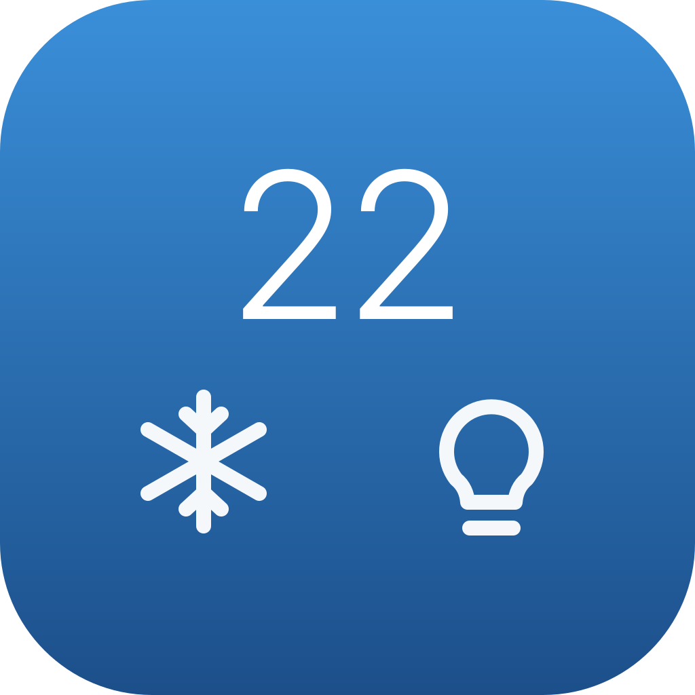

# RemoWidget

Nature Remo のエアコンと照明を、macOS のデスクトップウィジェットから操作します。

> **非公式ツールです。** 個人が趣味で作ったもので、Nature 株式会社とは一切関係ありません。
> "Nature Remo" は Nature 株式会社の商標です。
> 本ソフトウェアの利用によって生じた損害について作者は責任を負いません。

Nature Remo に公式の macOS アプリは無く、Mac から操作するにはブラウザを開くか iPhone を取り出す必要がありました。これは Cloud API を直接叩いて、**デスクトップに常駐するウィジェットから、室温を見ながら操作する**ためのものです。



## できること

- **室温の表示**（Remo 本体のセンサー値、取得時刻つき）
- **エアコン** — 冷房 / 暖房 / 除湿の切り替え、温度 −+、停止
- **照明** — 全灯 / 豆電球 / 消灯（登録した複数台を**同時に**操作）
- 現在のモードと照明シーンをウィジェット上で確認できる

風量は最大・風向は swing で固定送信するため、選択 UI を持ちません。そのぶん 1 画面に全機能が収まります。

## 動作環境

- macOS 14 以降（インタラクティブウィジェットが必要）
- Xcode（ビルドに必要）
- Apple Developer アカウント — App Group と Keychain 共有にプロビジョニングプロファイルが要るため。**配布はしないのでローカル署名のみ**

## セットアップ

### 1. アクセストークンを発行する

[https://home.nature.global/](https://home.nature.global/) にログインし、Developer メニューから Access Token を発行します。

### 2. Team ID を設定する

```bash
cp Local.xcconfig.example Local.xcconfig
```

`Local.xcconfig` を開き、`DEVELOPMENT_TEAM` に自分の Team ID を書きます。次のコマンドで確認できます（括弧内の 10 文字）。

```bash
security find-identity -v -p codesigning
```

Team ID を書くのはこの 1 箇所だけです。App Group と Keychain Access Group の識別子は、Xcode がプロビジョニングプロファイルから解決した値をビルド時に埋め込みます（`Local.xcconfig` はコミットされません）。

Bundle ID を変える場合は `project.yml` の `PRODUCT_BUNDLE_IDENTIFIER` と `APP_BUNDLE_IDENTIFIER` の両方を揃えてください。

### 3. ビルドしてインストールする

```bash
./build.sh install
```

`~/Applications/RemoWidget.app` に配置され、設定ウィンドウが開きます。
初回は Xcode で開いて Signing & Capabilities から「Register Device」が必要な場合があります。

### 4. トークンと機器を設定する

設定ウィンドウでトークンを貼り付け、「保存して接続テスト」を押します。成功するとエアコンと照明が自動で選択されます。

トークンは **Keychain** に保存されます（UserDefaults や設定ファイルには書きません）。

### 5. ウィジェットを配置する

デスクトップの何もないところを右クリック →「ウィジェットを編集」→ 「Remo」を検索 → **Large サイズ**をドラッグします。

## 開発

```bash
./build.sh install
```

`project.yml` から XcodeGen で `.xcodeproj` を生成してビルドし、`~/Applications` へ配置します。`.xcodeproj` は生成物なのでリポジトリには含めません。

```bash
./Tests/run.sh
```

エアコンの温度・モードのロジックを単体テストします。ネットワークに触れないので API 制限と無関係に何度でも実行できます。

```bash
./Tools/watch-rate-limit.sh 60 60
```

API のレート制限（30 リクエスト / 5 分）の消費量を観測します。ウィジェットが記録した値を読むだけなので、観測自体は API を消費しません。

## 構成

```
Sources/
├── RemoKit/     アプリとウィジェット拡張が共有するロジック
│   ├── Models          API レスポンスと共有スナップショット
│   ├── NatureAPIClient Cloud API 呼び出し・レート制限管理
│   ├── AirconLogic     温度ステップ・モード切替の丸め（テスト対象）
│   ├── LightLogic      照明シーンの判定
│   ├── TokenStore      Keychain
│   ├── SharedStore     App Group 経由の状態共有
│   └── SnapshotLoader  表示用データの組み立て
├── App/         設定ウィンドウ（Dock に出ない。設定時だけ起動する）
└── Widget/      ウィジェット本体と操作 Intent
```

アプリ本体は設定を書き込むためだけに起動します。ウィジェット拡張は別プロセスなので、アプリを終了してもウィジェットは動き続けます。

## 実装上の注意点

同じものを作る人が踏みやすい罠です。詳細は [REQUIREMENTS.md](REQUIREMENTS.md) を参照してください。

- **温度は 0.5℃ 刻み** — 機種の `aircon.range` を読み、リストに実在する値だけを送ること。`現在値 ± 1` を組み立てて送ると壊れます
- **モードで温度範囲が違う** — 暖房 16℃ から冷房（18℃ 始まり）へ切り替えると範囲外になるため、最も近い値へ丸める必要があります
- **デスクトップウィジェットは vibrant レンダリング** — 色が輝度に変換されるので、濃い色で塗ると白い塊になり、その上の白文字は消えます。選択状態は色相ではなく濃さの差・縁取り・形で示します
- **楽観的更新ではキャッシュの取得時刻も進める** — 進めないと直後の再描画が期限切れと判定され、API を叩き直して数秒のラグになります
- **AppIntent には `openAppWhenRun = false` を明示** — 省略すると押すたびに設定ウィンドウが開きます
- **App Group には Team ID の前置が必要** — ソースに直書きせず、entitlements と Info.plist で `$(TeamIdentifierPrefix)` を使えば環境依存を追い出せます

## ライセンス

MIT
